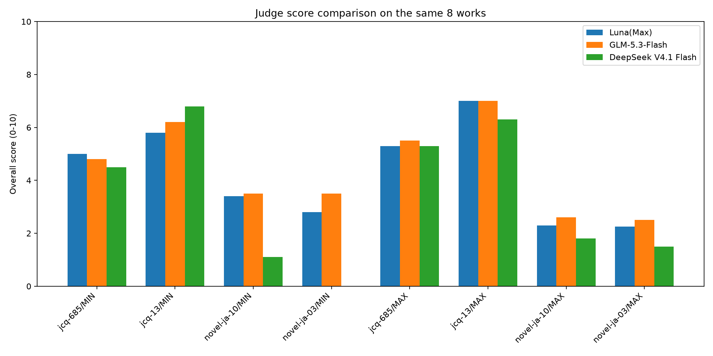
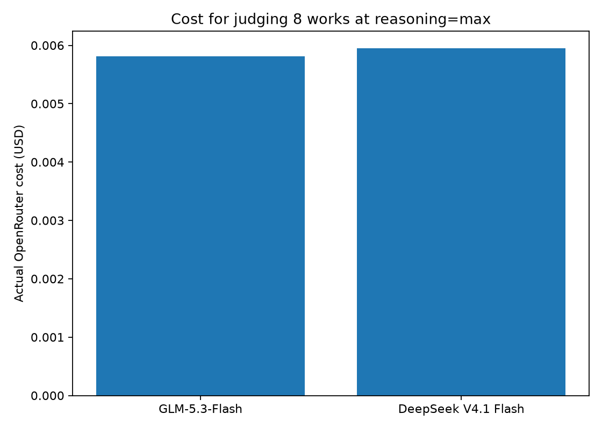
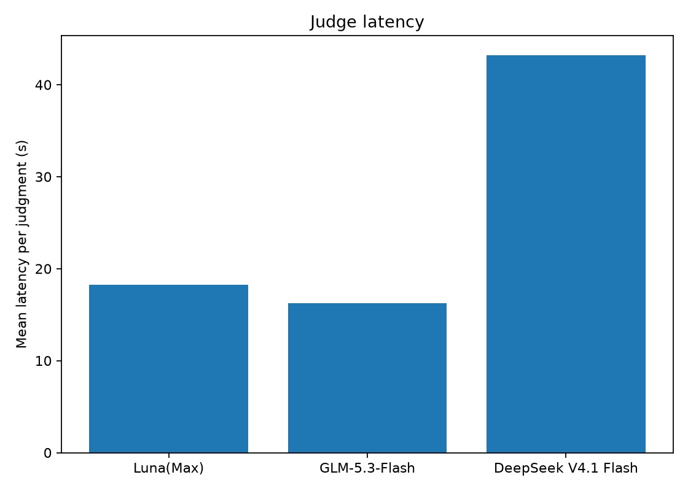

# Judge comparison — 2026-09-13

`smoke-20260913c` の同じ8作品を、同一rubric・blind条件で再採点した小規模な校正試験です。生成モデルは再実行していません。OpenRouter側2モデルは `reasoning=max` と strict JSON Schemaを使用し、対応パラメータを満たすendpointのうちprice routingを使用しました。Lunaも既存の `reasoning=max` 採点を再利用しています。GLM `z-ai/glm-5.3-flash` を標準Judgeとして採用した根拠は、この実測のJSON遵守、Lunaとの一致度、速度、実コストです。

## 実測サマリー

| Judge | JSON成功 | 平均overall | 平均latency | reasoning tokens/件 | 実コスト(8件) |
|---|---:|---:|---:|---:|---:|
| gpt-5.6-luna | 8/8 | 4.231 | 18.26s | 701.4 | Included |
| glm-5.3-flash | 8/8 | 4.450 | 16.27s | 1141.9 | $0.005812 |
| deepseek-v4.1-flash | 7/8 | 3.900 | 43.17s | 1027.9 | $0.005945 |

## Luna(Max)との一致度

| Judge | Pearson | Spearman | MAE |
|---|---:|---:|---:|
| glm-5.3-flash | 0.990 | 0.994 | 0.269 |
| deepseek-v4.1-flash | 0.927 | 0.857 | 0.821 |







## 注意

8作品だけのsmoke校正なので、文学的Judgeの最終結論には小さすぎます。ここではJSON遵守、相対順位、速度、実請求コストを確認します。quick/fullのJudge選定では、相関だけでなくMIN/MAX勝敗の一致と再現性も重視します。

生データ: `data/judgments.jsonl` / `data/summary.json` / `data/judge_metrics.csv` / `data/correlations.csv`。OpenRouterのresponse metadataは `logs/` に保存しています。認証キーとAuthorization headerは保存していません。

再実行（OpenRouter API料金が発生）:

```text
cd /home/ws2/repos/ollama-novel-bench
uv run python scripts/compare_judges.py
```
