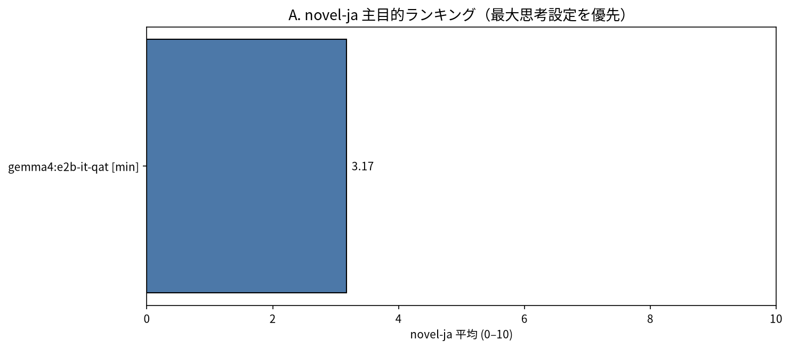
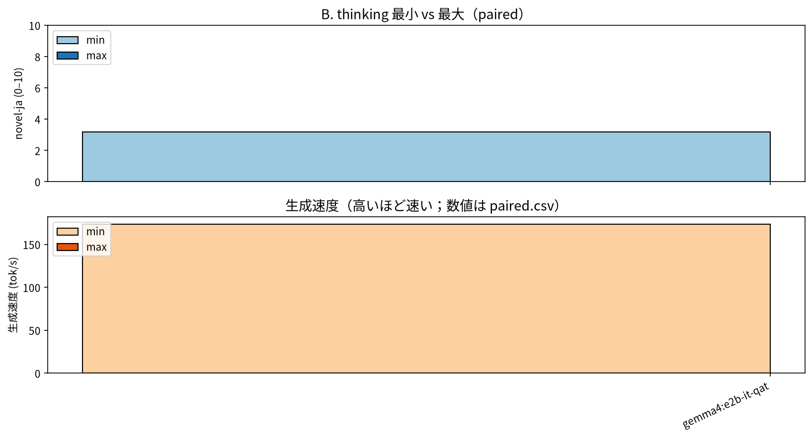
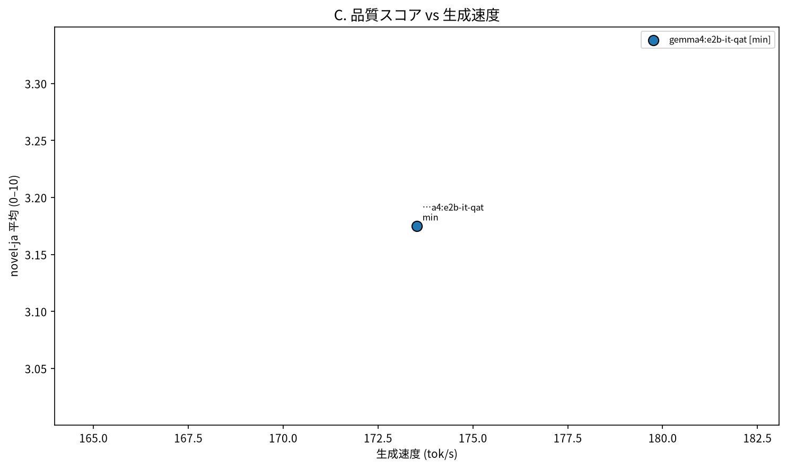
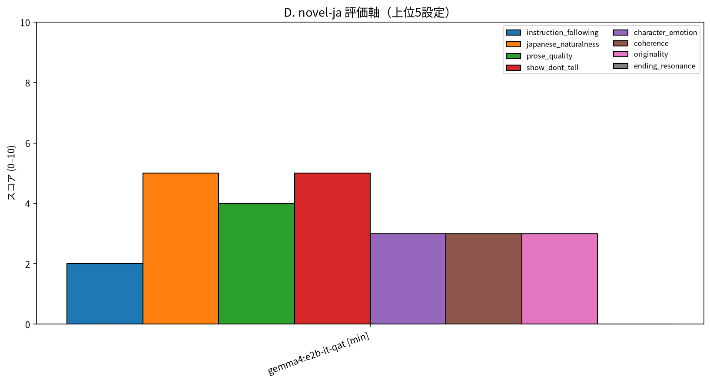
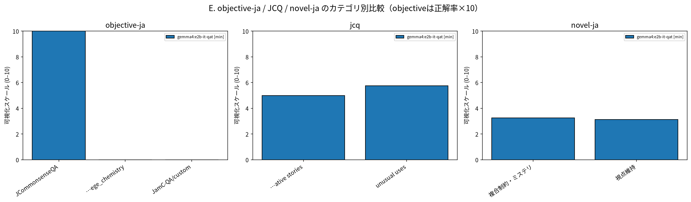

# Run `smoke-20260913`

- profile: `smoke`
- status: `complete_with_errors`
- generation rows: 14 / planned: 14 / pending: 0 / errors: 7
- judge rows: 4 / pending: 0 / errors: 0

> **注意: 予備試験・ランキング用途不可。この結果はランキング用途不可です。**

## 主目的ランキング: novel-ja

モデルごとに `max` 設定を優先（非thinkingモデルは `none`）。主目的を一つの総合点へ潰さず、objective / creativity / novel / performance を別列で示します。

| rank | model | thinking | novel-ja | JCQ | objective-ja | tok/s | ok/total |
|---:|---|---|---:|---:|---:|---:|---:|
| 1 | `gemma4:e2b-it-qat` | `min` | 3.17 | 5.38 | 0.333 | 173.52 | 7/7 |

## モデル × thinking 設定

| model | size | mode | novel-ja | JCQ | objective-ja | tok/s | output chars | thinking chars | failure rate |
|---|---|---|---:|---:|---:|---:|---:|---:|---:|
| `gemma4:e2b-it-qat` | 4.6B | `max` | — | — | — | — | — | — | 1.000 |
| `gemma4:e2b-it-qat` | 4.6B | `min` | 3.17 | 5.38 | 0.333 | 173.52 | 366.00 | 0.00 | 0.000 |

## thinking max の差分

`paired.csv` は同じモデルの min/max を対応付けます。品質差は `max - min`、速度差は tok/s の差と低下率です。

| model | novel min | novel max | quality Δ | tok/s min | tok/s max | speed Δ% |
|---|---:|---:|---:|---:|---:|---:|
| `gemma4:e2b-it-qat` | 3.17 | — | — | 173.52 | — | — |

## Judge評価内訳

`axis_scores.csv` に全軸を保存しています。novel-ja は instruction_following / japanese_naturalness / prose_quality / show_dont_tell / character_emotion / coherence / originality / ending_resonance、JCQ は fluency / flexibility / originality / elaboration です。

## 失敗・未完了

- generation planned: 14
- generation pending: 0
- generation errors: 7
- judge pending: 0
- judge errors: 0
- 詳細: [failures.csv](data/failures.csv)

## 可視化

## 追跡可能なデータ

- 生成全文・thinking・Ollamaメトリクス: [generations.jsonl](data/generations.jsonl)
- Judge JSONとusage/stdio参照: [judgments.jsonl](data/judgments.jsonl)
- 選択した設問: [items.jsonl](data/items.jsonl)
- machine-readable集計: [summary.csv](data/summary.csv), [ranking.csv](data/ranking.csv), [paired.csv](data/paired.csv), [axis_scores.csv](data/axis_scores.csv), [category_scores.csv](data/category_scores.csv)

